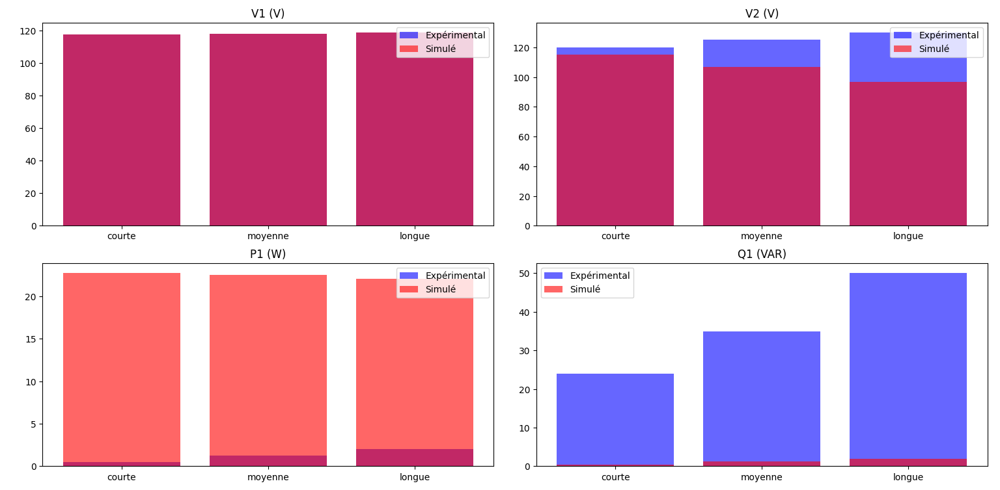
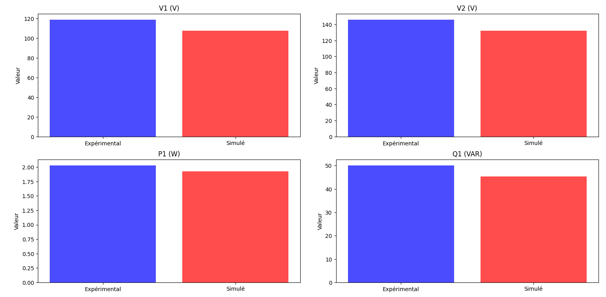

# Simulation des Câbles Souterrains

## Description
Ce TP implémente une simulation des performances des câbles souterrains en modélisant les pertes et les variations de tension, de puissance active et réactive. Il permet d'évaluer le comportement des câbles en conditions réelles et de comparer les résultats expérimentaux et simulés.

## Fonctionnalités
- Modélisation mathématique des câbles souterrains
- Simulation des paramètres électriques :
  - Tension aux bornes (V1, V2)
  - Puissance active (P1)
  - Puissance réactive (Q1)
- Comparaison des valeurs expérimentales et simulées
- Visualisation des résultats sous forme de graphiques

## Installation
1. Cloner le dépôt GitHub :
   ```bash
   git ARTD_TP01
   cd ARTD_TP01
   ```
2. Installer les dépendances :
   ```bash
   pip install -pandas numpy matplotlib 
   ```

## Utilisation
Exécuter le script de simulation :
```bash
python ligne.py
python soutr.py
```

## Résultats et Visualisation
Les résultats sont générés sous forme de graphiques comparant les valeurs expérimentales et simulées. Voici un aperçu des sorties :



## Structure du Projet
```
/chemin_du_projet
│── ligne.py  # Script principal
│── soutr.py   
│── figures/  # Dossier contenant les visualisations générées
│── README.md # Documentation du projet
```


---
✍️ **Auteur :** Nihed Aouf
🚀 **Projet de  TP ARTD simulation Performances d’une Ligne `a Vide **
